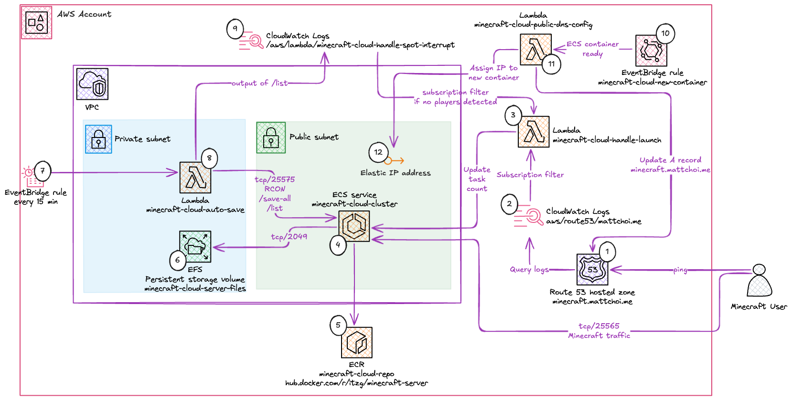

# Minecraft Cloud Serverless

## Overview ☁️

This project contains the infrastructure as code (IaC) that builds the AWS resources needed to host a Minecraft server.  The goal is to minimize cost by using serverless resources to run a Mineraft server.

The current market price for a month of Minecraft server hosting (Realms for Java Edition) sits around [$10.00 USD per month](https://www.minecraft.net/en-us/realms/realms-for-java/plans).  This project attempts to beat out that price, and still provide sufficient performance and availability.  

## Architecture Diagram



The above diagram outlines all the resources used within this Terraform project.

## Technology Stack 🚀

- Leverages cloud-native [Amazon web services](https://aws.amazon.com/) (AWS) 
- Lambdas all leverage NodeJS runtimes with the [AWS JavaScript SDK](https://docs.aws.amazon.com/AWSJavaScriptSDK/v3/latest/)
- The only compute component is [AWS elastic container service (ECS)](https://aws.amazon.com/ecs/) which runs a given [Docker image](https://docs.docker.com/get-started/docker-concepts/the-basics/what-is-an-image/)
- The majority of files in this repository are AWS services created in [Terraform](https://www.terraform.io/) infrastructure as code (IaC)

## Let's build it 🔨

### Pre-requisites

```bash
# Don't have Terraform/Terragrunt installed?  Run the following as needed
brew install terraform
brew install terragrunt

# Make sure to be using NodeJS version 22
brew install nvm
nvm install 22.8.0
nvm use 22.8.0

# Should output v22.8.0
node --version
```

This project also assumes you have a custom domain name (ex: `mattchoi.me`) and a hosted zone to create DNS records inside of.  You can specify the hosted zone you want to use at `var.minecraft_server_domain`.  Moreover, this project will use the `minecraft.mywebsite.com` subdomin (modifiable in the _variables.tf file).  The costs for these are not accounted for in the pricing estimates, however for the record it costs $0.25/month per hosted zone.

### Local deployment

```bash
# Ready to provision the architecture?  Ensure you have AWS credentials set in your environment and run the following
# MacOS/Linux
export ACCOUNT_NUMBER=<your AWS account number>
# Windows PS
$Env:ACCOUNT_NUMBER=<your AWS account number>

# Make sure you have an S3 bucket (Terraform state files) and DynamoDB table (state lock) created with the below naming convention or use the following commands directly to create them:
aws s3api create-bucket --bucket "terraform-state-$ACCOUNT_NUMBER" --versioning-configuration Status=Enabled
aws dynamodb create-table --table-name "terraform-lock-$ACCOUNT_NUMBER" --attribute-definitions AttributeName=LockID,AttributeType=S --key-schema AttributeName=LockID,KeyType=HASH --billing-mode PAY_PER_REQUEST

# Finally we will need to make sure to install the required packages in the Lambda layer for the auto-save function
cd auto-save/layer/nodejs
npm install

# Note that this will deploy the workload to your AWS account
terragrunt apply
```

Note that the above commands will incur costs on your AWS account.  Use at your own risk.  Ensure that the launch Lambda can correctly shut down the server when no users are online.

## Cost Breakdown by Service 💰

### Networking 🛜

  - This solution intentionally avoids the user of a load balancer (specifically network load balancer for the tcp/25565 Minecraft protocol) as this has a $0.0225/hour rate ($16.20/month) and has an "always on" pricing model
  - Instead, the solution uses an automatically assigned public IP address on the provisioned Minecraft ECS container.  These are dynamic every time the server is reprovisioned, but are much cheaper at $0.005/hour (although the [used to be free](https://aws.amazon.com/blogs/aws/new-aws-public-ipv4-address-charge-public-ip-insights/))
  - The trade off with price is that this adds complexity.  When the ECS container is provisioned, there is a custom Lambda that must update the A record for `minecraft.mattchoi.me` so that it points to the newly acquired public IP

### Compute 🖥️

  - Compute is expected to be the highest cost when running the Minecraft servers
  - A great way to save on compute instances is to leverage [ECS fargate spot](https://aws.amazon.com/blogs/aws/aws-fargate-spot-now-generally-available/) to save up to 70% off container pricing!
  - This workload runs 4vCPUs with 8GB RAM which comfortably runs a server with less than 10 active users, and costs only $0.06 per hour 🤑 ($0.05 for compute and $0.01 for memory) 
  - If this was **always** on, then it would end up costing $43.20 per month which is even close to the goal of beating realms ($10/month)
  - However, this system will shut down if there are no players online.  Even for the most hardcore of gamers, 50 hours of Minecraft a month would only cost $2.50 since the remaining 670 hours of a given month would have a compute cost of $0
  - If you end up playing over 200 hours of Minecraft a month, buying a plan on realms is the best case scenario for you as at that point anything beyond 200 hours with this solution would be greater than $10/month
  - Even with three Lambda functions, we never get close to the free tier limits of 1 million requests and 400K GB/s per month setting out Lambda totals to $0

### Storage 💾

  - This project uses ECR to store container images, which is free for up 50GB of images (the Minecraft image is ~300MB)
  - Further EFS is used to store persistent Minecraft world files.  This has a cost of $0.30/GB/month, which with a single world (~0.5GB) costs around $0.16/month

## Can I save money with this? 🤔

Similar to all things in tech, it depends.  See some pricing examples below for the two different type of Minecraft players:

  - Guilty pleasure Minecrafter
    - Plays for a single 20 hours in a few sessions a month
    - Using this system, will pay $1.00 for the compute
    - Optionally could store the world saves for next Minecraft playtime splurge (likely a year later), but decides to not store it long than a single month for $0.16
    - The grand total including the cost of the public IP ($0.10 for 20 hours) will be **$1.26** which beats realms price by 87.4%!
  - Regular hobbyist Minecrafter
    - Plays regularly 8 hours a week for a total of around 45 hours
    - Using this system, would cost $2.25 for the compute
    - Deciding to store the worlds long term would require a larger storage fees and the size of the world directly impacts file size.  An initial world could be ~300MB but over time it is possible to have worlds up to 100GB and beyond.  We can assume within a given month it's likely the file size wouldn't increase beyond 1GB so we can assume the same $0.16 cost
    - The grand total including the IP cost ($0.23 for 45 hours) is **$2.64** which also beats realms by 73.6%!

## Could the system be improved?

After the cost analysis above, there are some clear questions that could be addressed by further architecture changes to this diagram:

- For EFS storage, could there be some internal archive mechanism that moves a given save to an "archive" tier in S3 where a glacier policy decreases the storage down to $0.004/GB/month (could even leverage free tier for up to 5GB for 1 year)
- Changing world saves is a tedious and manual process that requires changing in `ecs.tf` the `LEVEL` environment variable to a new/existing save and redeploying the container.  What if there was a UI that would expose this setting and would allow non-technical users to orchestrate world save changes?  Or better yet, change this within the Minecraft console (with some custom text command)
- There is no security on who can start/stop the Minecraft server beyond knowing the domain name configured with the query log container start process.  Implementing a whitelist of permissions on the server can assist with security (namely [griefing](https://minecraft-archive.fandom.com/wiki/Griefing)) but still it doesn't stop a malicious actor from forcing a server to run by continuously pinging the connected domain

If you are interested in providing a fix for these issues, submit a PR on this repo or fork it and start building!